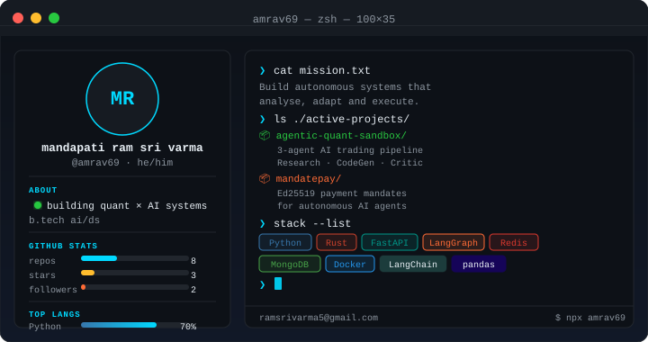
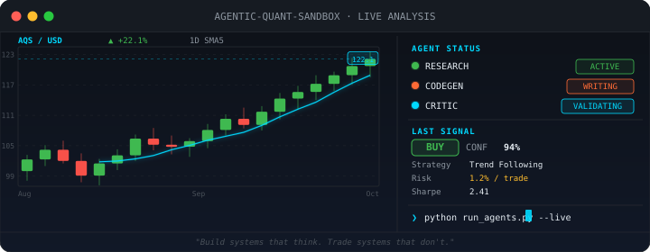

<!-- Terminal identity card — self-hosted -->

---

## ⚡ Active Development

| Project | Lang | Status | What it does |
|:--------|:----:|:------:|:-------------|
| [**agentic-quant-sandbox**](https://github.com/amrav69/agentic-quant-sandbox) | 🐍 Python | `● LIVE` | Autonomous 3-agent AI trading pipeline — Research, CodeGen & Critic agents that analyse markets, write backtests, and validate strategies |
| [**mandatepay**](https://github.com/amrav69/mandatepay) | 🦀 Rust | `● LIVE` | Signed payment mandates for AI agents — Ed25519 intent mandates with spend caps, expiry & replay protection |

---

## 🛠️ Stack

---

## 📊 Contribution Streak

---

<!-- Algo trading terminal — self-hosted -->

---

## 🤝 Connect

